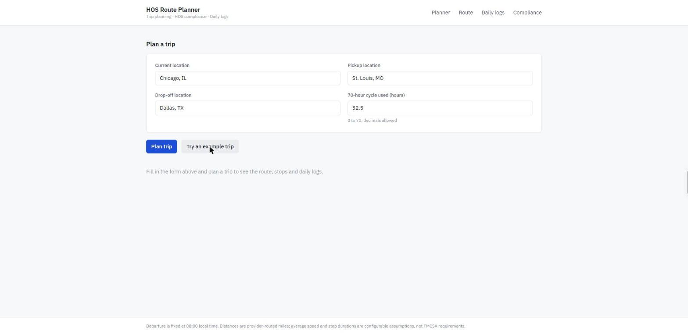
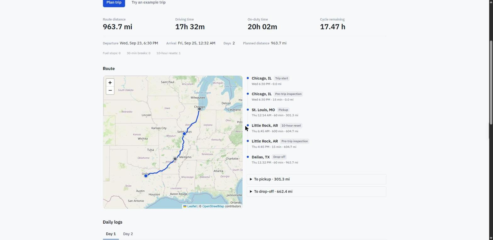
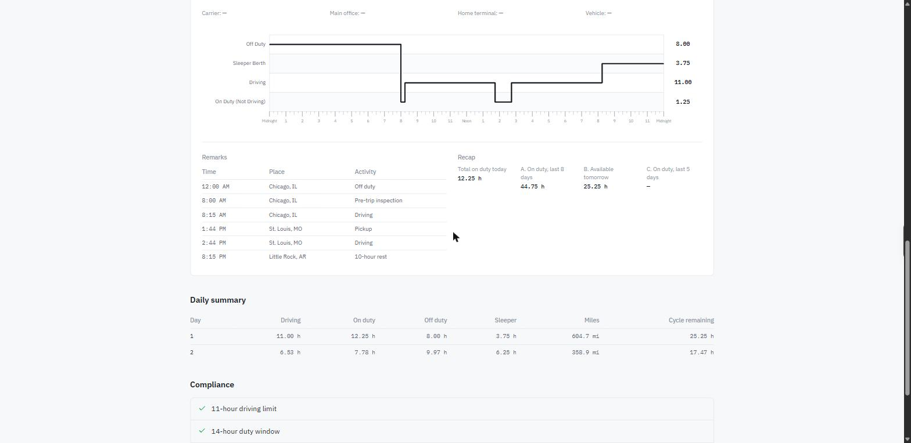
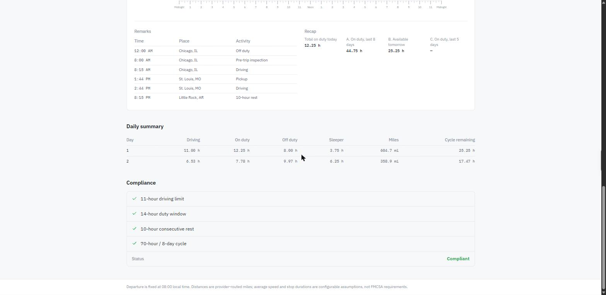
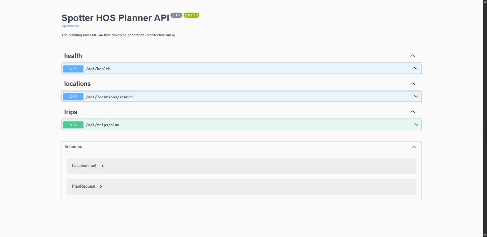
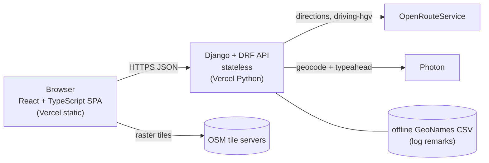
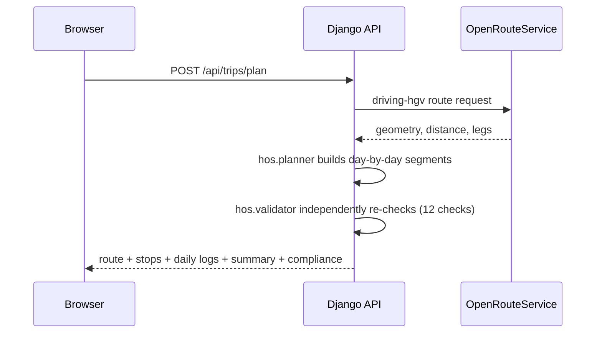

# HOS Route Planner

A trip planner and FMCSA-style driver daily-log generator for property-carrying commercial drivers.
Enter a current location, a pickup, a drop-off and the hours already used on the current 70-hour/8-day
cycle, and get back a routed map with fuel and rest stops, one 24-hour log sheet per day of the trip,
a daily summary of drive/on-duty/off-duty time, and a compliance breakdown against the modeled HOS rules.

Built as a full-stack take-home assessment: Django/DRF API with a from-scratch, independently-verified
HOS engine, and a React/TypeScript frontend that renders the results (and never recomputes them).

## Status

Feature-complete for its scope and deployed. The HOS planning engine, routing integration, API and
log-sheet UI are implemented and covered by automated tests (215 backend, 32 frontend), and the app runs
both locally (see [Run it locally](#run-it-locally)) and at the live URLs below.

## Live demo

| | |
| --- | --- |
| **App** | <https://hos-route-planner-drab.vercel.app> |
| **API** | <https://hos-route-planner-api.vercel.app> |
| **API docs (OpenAPI/Swagger)** | <https://hos-route-planner-api.vercel.app/api/docs/> |
| **Health check** | <https://hos-route-planner-api.vercel.app/api/health> |

Click **"Try an example trip"** on the planner page for a pre-filled multi-day route, or enter your own.
Both projects run on Vercel's serverless runtime, so the first request after a period of idleness can take
a few seconds to cold-start.

## Screenshots

**Planner** — current location, pickup, drop-off and cycle hours used:



**Route and HOS schedule** — routed map, stop-by-stop timeline and trip-level totals:



**Daily logs** — one hand-built SVG 24-hour grid per day, with remarks and the 70-hour recap:



**Compliance** — the independent validator's checks against the schedule this planner produced:



**API documentation** — live OpenAPI schema, browsable at `/api/docs/`:



## Engineering highlights

- **Two independent HOS implementations, not one.** `hos/planner.py` builds the schedule (event-driven);
  `hos/validator.py` re-derives it from scratch minute-by-minute against 12 named checks and shares no
  code with the planner. A plan the validator rejects is never returned to the client.
- **Pure-Python domain core.** `backend/trips/hos/` has zero Django, HTTP-client or wall-clock
  dependencies — every rule is a plain function over frozen dataclasses, unit- and property-tested
  (Hypothesis) in isolation from the web framework.
- **Contract-first API.** DRF serializers generate an OpenAPI schema (`drf-spectacular`), which generates
  the frontend's TypeScript types (`openapi-typescript`) — the client can't silently drift from what the
  server actually returns.
- **A hand-built SVG log sheet**, not a canvas or bitmap overlay — the same pixel-accurate 24-hour grid
  a paper FMCSA log uses, drawn from the same segment list the totals are computed from.
- **Fails loudly, never silently.** A single typed error envelope for real failures; a trip that can't be
  completed within the driver's remaining cycle hours (`cycle_exhausted`) is a modeled HTTP 200 result with
  the unplanned remainder attached, not a swallowed edge case — and the planner never auto-inserts a
  34-hour restart to make the numbers work.
- **An architectural guard test.** A test greps the frontend source for HOS constants and scheduling logic
  and fails the build if any turn up — the schedule is computed exactly once, server-side.
- **Stateless by construction.** No database, no sessions, no auth surface to secure — two independent
  Vercel deployments (static frontend, serverless Django API) configured entirely through environment
  variables.

## Features

- **HOS-compliant trip planning** — given a start, pickup, drop-off and cycle hours already used, computes
  a day-by-day schedule of driving, on-duty, sleeper-berth and off-duty segments that respects the 11-hour
  driving limit, 14-hour on-duty window, 30-minute break rule, 10-hour reset and the 70-hour/8-day cycle.
- **Route map** — driving directions and stop markers rendered on an OpenStreetMap base layer, using
  OpenRouteService (`driving-hgv` profile) for the route geometry and drive times.
- **Location typeahead** — address/place search backed by Photon.
- **Multi-day planning** — trips that span more than one day produce one log sheet and daily summary per
  day, all derived from the same underlying segment list the totals are computed from.
- **Cycle-exhaustion handling** — if a trip cannot be completed within the driver's remaining 70-hour
  allowance, the planner stops rather than inventing a restart, and returns the plan built so far with a
  `cycle_exhausted` status and the unplanned remainder (HTTP 200 — this is a result, not an error).

## Architecture



**Request flow** for `POST /api/trips/plan` — one synchronous call, one external dependency on the hot path:



- **Stateless** Django + DRF API, no database, no authentication. One main endpoint, `POST /api/trips/plan`,
  plus `GET /api/health`, `GET /api/locations/search` and an OpenAPI schema at `/api/docs/`.
- Routing and geocoding sit behind a `RoutingService` abstraction, isolating the HOS engine from any
  particular provider and from network failure modes.
- **The server computes everything that has to be correct** — schedule, segment minute-of-day placement,
  totals, remarks, the 70/60-hour recap and trip status. The React frontend handles form validation,
  rendering, interaction, map display and loading/error states; it does not implement HOS rules or
  recompute the schedule (enforced by the import-graph guard test mentioned above).
- **Deployment:** two independent Vercel projects from this one repository — `frontend/` (static Vite
  build) and `backend/` (Django on Vercel's Python runtime), each with its own Root Directory setting.
  They communicate over HTTPS/JSON with an explicit CORS allow-list; there is no shared server state.

Full design rationale, API contract and rules spec:

| Doc | Purpose |
| --- | --- |
| [`docs/hos-rules.md`](docs/hos-rules.md) | The HOS rules spec: decisions, assumptions, the planner algorithm, the validator's 12 checks, and the golden test scenarios. |
| [`docs/architecture.md`](docs/architecture.md) | System design, API contract at a glance, service boundaries, dependency choices. |
| [`docs/api-contract.md`](docs/api-contract.md) | Field-by-field request/response contract for `POST /api/trips/plan`, matching the running code. |
| [`docs/implementation-plan.md`](docs/implementation-plan.md) | Build phases, testing strategy, risk register, and the open questions/decisions log. |
| `GET /api/docs/` | Live, browsable OpenAPI 3 schema for the running backend. |

## Tech stack

| Layer | Stack |
| --- | --- |
| Backend | Python 3.12 · Django 5.2 LTS · Django REST Framework · stateless, no database |
| Routing / geocoding | OpenRouteService (`driving-hgv`) · Photon (typeahead) · offline GeoNames CSV (log remarks) |
| Frontend | React 19 · TypeScript (strict) · Vite · Tailwind CSS v4 · TanStack Query · react-hook-form + Zod |
| Map | Leaflet / react-leaflet over OpenStreetMap tiles |
| Tests | pytest + Hypothesis (backend) · Vitest + React Testing Library (frontend) |
| Hosting | Two Vercel projects (static frontend + serverless Django API), no shared infrastructure |

## Repository layout

```text
backend/    Django project (config/) and the trips app: api/, hos/ (pure Python), routing/, tests/
frontend/   Vite + React + TypeScript app (src/features/, src/components/, src/lib/)
docs/       hos-rules.md (rules spec) · architecture.md · api-contract.md · implementation-plan.md · screenshots/
```

## Prerequisites

- **Python 3.12** — not 3.14. On Windows the `py` launcher defaults to 3.14, so always ask for 3.12: `py -3.12`.
- **Node.js 22** and npm 11.

## Run it locally

Backend (PowerShell, from `backend\`):

```powershell
py -3.12 -m venv .venv
.\.venv\Scripts\Activate.ps1
pip install -r requirements-dev.txt
$env:DJANGO_DEBUG = "true"        # local development only; see Configuration
python manage.py runserver        # http://127.0.0.1:8000/api/health
```

Frontend (from `frontend\`):

```powershell
npm install
npm run dev                       # http://localhost:5173 — proxies /api to the backend
```

Routing and typeahead need an OpenRouteService API key (free tier) — see Configuration below. Without one,
the backend still runs, but `/api/trips/plan` and `/api/locations/search` calls that need live routing will
fail.

## Testing

```powershell
# backend (virtual environment active, from backend\)
pytest ; ruff check . ; ruff format --check . ; mypy

# frontend (from frontend\)
npm run lint ; npm run typecheck ; npm test ; npm run format:check ; npm run build
```

The backend test suite includes hand-computed "golden" scenarios (S1–S6 and a boundary variant), explicit
boundary-condition tests, and property-based tests (Hypothesis) asserting invariants like "every daily log
sums to exactly 1,440 minutes" and "the plan the validator accepts is the plan the planner produced." Live
network calls to OpenRouteService/Photon are opt-in only (`pytest -m live`) and excluded from the default run.

## Configuration

All configuration is read from real environment variables — nothing is hardcoded and no secret is ever
committed. For local development, `backend/config/settings.py` also loads a `backend/.env` file if one
exists (via `python-dotenv`), so you can keep local values in a git-ignored file instead of exporting them
in every shell; values already set in the real environment always take precedence, and no `.env` file is
ever read outside that local convenience path. `backend/.env.example` and `frontend/.env.example` document
the variable names only — never fill them in and commit the result.

| Variable | Purpose | Default |
| --- | --- | --- |
| `DJANGO_SECRET_KEY` | Django secret key | required unless `DJANGO_DEBUG=true` |
| `DJANGO_DEBUG` | development mode | `false` |
| `DJANGO_ALLOWED_HOSTS` | comma-separated host allow-list | `localhost,127.0.0.1` |
| `CORS_ALLOWED_ORIGINS` | comma-separated origins allowed to call the API | `http://localhost:5173` |
| `ORS_API_KEY` | OpenRouteService key — **environment only**, never a file, the repo or the frontend | none (routing calls fail without it) |
| `ORS_BASE_URL` | OpenRouteService base URL | `https://api.heigit.org/openrouteservice` |
| `PHOTON_BASE_URL` | Photon typeahead base URL | public Photon instance |
| `AVG_TRUCK_SPEED_MPH` | average speed used for drive-time estimates | `55` |
| `UPSTREAM_TIMEOUT_S` | timeout for routing/geocoding HTTP calls | `10` |
| `THROTTLE_PLAN` / `THROTTLE_SEARCH` | DRF throttle rates for the plan/search endpoints | `30/min` / `120/min` |
| `LOG_CARRIER_NAME`, `LOG_MAIN_OFFICE`, `LOG_HOME_TERMINAL`, `LOG_TRUCK_NUMBER` | optional header fields printed on the log sheet | empty |
| `VITE_API_BASE_URL` | API origin used by the frontend | empty (the dev server proxies `/api`) |

## Assumptions and limitations

The full rules spec and every assumption live in [`docs/hos-rules.md`](docs/hos-rules.md). Worth stating
precisely here:

- **The 70-hour cycle counting driving *and* on-duty-not-driving time is a deliberate product constraint,
  not a claim about FMCSA's exact regulatory wording.** FMCSA's on-duty limit is framed around driving
  after a given number of on-duty hours; this planner is intentionally stricter — it counts all on-duty
  time toward the 70-hour/8-day allowance and stops scheduling further on-duty activity once that
  allowance is exhausted, returning `cycle_exhausted` rather than continuing. It never invents an automatic
  34-hour restart.
- **This is a planning tool, not a compliance certification.** The "Compliance" section reports whether the
  *modeled* schedule this planner produced passes its own independent validator; it does not replace an ELD
  or a carrier's own HOS compliance program, and it makes no claim of legal or regulatory certification.
- Out of scope by design: authentication/accounts, saved trips or any database persistence, real-time fuel
  station lookup, live traffic or weather, team drivers, split-sleeper, the 60-hour/7-day cycle, short-haul
  exceptions, PDF export, and post-trip inspection.
- The trip start time is a fixed convention (08:00 local time on the trip origin's date), not a
  user-supplied field.
- Average speed (default 55 mph) and stop durations (e.g. a 15-minute pre-trip) are configurable
  assumptions used for scheduling, not FMCSA requirements.

## Attributions

- Map tiles © [OpenStreetMap](https://www.openstreetmap.org/copyright) contributors, attributed in-app on
  the route map.
- Offline US place lookup (used to render `City, ST` in log remarks) built from
  [GeoNames](https://www.geonames.org/) data, licensed [CC BY 4.0](https://creativecommons.org/licenses/by/4.0/).
