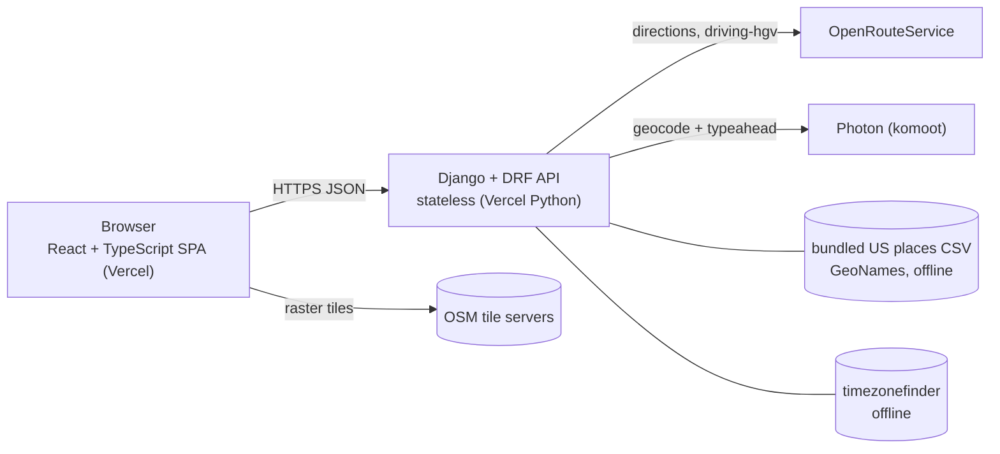

# Architecture

> **Status:** **rev 4** — see `implementation-plan.md` §9 for the full revision history. All phases (0–7a) described
> below are built: HOS engine, routing/API layer and frontend all exist and are covered by tests, per the current
> repository contents. Deployment (Phase 7b, hosting) has not happened — there is no live URL.
> Companion docs: [`hos-rules.md`](hos-rules.md) (the rules spec) · [`implementation-plan.md`](implementation-plan.md) (phases, tests, risks).
> "Verified" below means checked against the vendor's own documentation on 2026-09-21.

---

## 1. Goal and constraints

**Goal.** Given *current location, pickup, drop-off, current 70 h cycle used*, produce (a) a route map with stops,
rests and fuel points, (b) legally-plausible FMCSA-style **daily log sheets**, drawn and filled in, one per
24-hour day, and (c) daily summaries. Property-carrying driver, 70 h / 8 days, no adverse conditions.

**Judged on** (docx): accuracy of the hosted app · UI/UX and aesthetics · a 3–5 min Loom · GitHub code.

**Non-goals** (do not build): authentication, accounts, saved trips, any database, real fuel-station lookup, traffic,
weather, team drivers, split-sleeper, adverse-driving conditions, PDF export, and an **automatic 34-hour restart**
(modelled only as an internal, default-off planner option). See `hos-rules.md` §2.

**Quality attributes, in priority order:** 1) HOS correctness · 2) clarity/polish of the UI · 3) it is up and fast
when the reviewer clicks it · 4) testability · 5) small, explainable code.

## 2. System overview



**Plan request flow** (`POST /api/trips/plan`) — one synchronous call, one external dependency on the hot path:

```mermaid
sequenceDiagram
  participant B as Browser
  participant A as Django API
  participant O as OpenRouteService
  B->>A: POST /api/trips/plan {3 places, cycle_used_hours}   %% no departure input (Q4, A-16)
  A->>A: validate input (US bounds, cycle 0-70)
  A->>O: directions/driving-hgv [current, pickup, dropoff]
  O-->>A: geometry, 2 legs, steps
  A->>A: resolve timezone; build route index (mile -> lat/lng)
  A->>A: HOS planner -> segments -> independent validator
  A->>A: slice into 24 h logs; remarks via offline places; recap; summaries
  A-->>B: TripPlan JSON (everything precomputed)
```

Typical external calls per plan: **1** (routing). Typeahead adds calls to Photon while the user types.

## 3. Decision log

| ID | Decision | Rejected alternatives | Why / consequence |
| --- | --- | --- | --- |
| **AD-1** | **Stateless API, no database.** | SQLite/Postgres to persist trips | The docx is input → output; nothing needs storing. Removes migrations, DB hosting and serverless-filesystem problems. DRF runs with no auth/session classes; `DATABASES` left unset. Consequence: no shareable trip URLs (out of scope). |
| **AD-2** | **HOS engine is a pure-Python package** (`trips/hos`) with **zero** Django, DRF, HTTP-client, OpenRouteService or other external-API imports (stdlib only, enforced by an import-graph test); frozen dataclasses in, frozen dataclasses out. All HOS arithmetic is integer minutes (D-4). | Logic in views/serializers/models | Millisecond unit tests, property-based tests, no mocks. The rules are the product; they must be testable in isolation. |
| **AD-3** | **Server computes everything; React renders (D-8).** React does form validation, rendering, interaction, map display and loading/error states. It **must not implement HOS rules or calculate the authoritative schedule.** The response carries precomputed segments as minute-of-day, totals, remarks, recap, status and warnings. See §5.0. | Re-deriving totals/day-splits/cycle status in React | One implementation of the rules, in the language where the tests live. The client cannot drift from the validator. |
| **AD-4** | **One synchronous `POST /api/trips/plan`.** | Job queue + polling (Celery/Redis) | Latency ≈ one routing call (~1–3 s). Vercel Hobby allows 300 s (verified). A queue is pure cost here. |
| **AD-5** | **Routing = OpenRouteService `driving-hgv` on the current HeiGIT host `api.heigit.org`** — the old `api.openrouteservice.org` is deprecated, shuts down **2026-09-28** and is never used (verified 2026-09-21); we take **distance, geometry, steps only**. Drive *time* comes from our average-speed assumption (A-8). | OSRM public demo (best-effort, "no quality guarantees, excessive use blocked" — verified; car profile, to confirm); Google/Mapbox (billing/card); self-host | HGV profile suits a property-carrying CMV and ORS documents its limits (max 6,000 km, 50 waypoints — verified). Kept behind a **`RoutingService`** abstraction (D-7): the HOS engine never sees HTTP, ORS or any provider type — `services.py` hands it plain leg distances. **`driving-hgv` is an external provider dependency and may fail** (quota, outage, 5xx, timeout, unroutable); failure is a first-class typed outcome (§4.4), not an exception path. OSRM is an *optional* fallback adapter (~60 LOC) if the ORS spike shows flakiness. |
| **AD-6** | **Geocoding + typeahead = Photon, via a backend proxy** (`GET /api/locations/search`), US results only. | **Nominatim: rejected** — its policy forbids typeahead ("you must not implement such a service") and caps at 1 req/s (verified). | Photon lists typeahead as a feature but "extensive usage will be throttled" and has no availability guarantee (verified) → proxy caches results and we keep ORS geocoding as fallback. Concentrating traffic behind one server IP is a known risk (see implementation-plan risk R-4). |
| **AD-7** | **Offline nearest-place lookup for log remarks** (`City, ST`). Data = GeoNames US populated places (CC BY 4.0, attribution in README), trimmed to name/state/lat/lng by a committed build script, ~<1 MB CSV, pure-Python grid index. | Online reverse geocoding for every stop (15–25 calls per trip: quota burn + latency; Nominatim 1 req/s); `reverse_geocoder`/scipy (heavy) | FMCSA remarks need a city/state at **every** duty-status change (guide p.17). Offline = free, deterministic, unit-testable. Trade-off: "nearest populated place" can differ from what a human writes; the guide allows "nearest city, town, or village". |
| **AD-8** | **Log sheet = React SVG component** that re-creates the paper form. | Canvas; drawing over `blank-paper-log.png` | The PNG is 513×518 px — blurry and un-testable. SVG is crisp at any size, printable, assertable in tests (`<path d>`), and accessible. The PNG stays a *layout reference* only. |
| **AD-9** | **Hosting: two Vercel projects from one repo** — `frontend/` (static Vite build) and `backend/` (Django on Vercel's Python runtime). | Render free (spins down after 15 min idle, ~1 min wake — verified; bad first impression); Cloud Run (needs billing account); PythonAnywhere (outbound allow-list risk) | Vercel officially supports Django (docs updated 2026-07-24), detects `manage.py`, WSGI; Hobby: 300 s, 2 GB, 500 MB Python bundle, 4.5 MB body (all verified). One platform, no sleep. **Fallback:** Render + gunicorn if the Python runtime misbehaves. **Action:** local Vercel CLI is 50.4.0; Django deploys need ≥ 50.38.0 — upgrade. |
| **AD-10** | **SPA on Vite**, not Next.js. | Next.js | No SSR/SEO need; simplest static deploy; docx says "Django and React". |
| **AD-11** | **Time model:** integer minutes; one fixed UTC offset per trip; home TZ = current-location TZ (A-15). API sends ISO-8601 with offset *and* minute-of-day integers for the grid. | Per-day DST-aware offsets; client-side TZ math | Guarantees every log is exactly 1,440 min. The client never does time-zone arithmetic. Limitation: a DST change mid-trip shifts wall-clock by 1 h (documented). |
| **AD-12** | **Contract-first typing:** DRF serializers → `drf-spectacular` OpenAPI → `openapi-typescript`. Also gives reviewers `/api/docs/`. | Hand-written TS types only | Response is large and nested; drift is the likeliest integration bug. **Cut line:** if behind schedule, hand-write `types/api.ts` and keep the contract test. |
| **AD-13** | **Fail loudly, never silently.** A plan that fails the validator → 500 `plan_self_check_failed`. Upstream failures → typed 502/504. Missing place name → `"near 41.88, -87.63"`, not a blank. | Best-effort degraded output | Accuracy is what gets tested; a wrong-but-plausible log is the worst outcome. |
| **AD-14** | **Cycle exhaustion is a result, not an error — and no restart is invented.** The 70 h allowance caps *all* scheduled on-duty time, driving and on-duty-not-driving (D-1) — a product constraint, not an FMCSA requirement (FMCSA's limit is framed around driving). If the trip needs more, the planner stops at the last legal moment and the API returns **HTTP 200** with `summary.status = "cycle_exhausted"`, a `cycle_exhausted` warning of severity `violation`, and the unplanned remainder. A 34-hour restart exists only as an internal `PlanParams.allow_34_hour_restart` (default `false`; **not** in the API, environment or UI) (D-2). | Auto-inserting a restart; returning a 4xx | Silently inventing a restart hides a real cycle problem; a 4xx would throw away a perfectly legal partial schedule the user needs to see. Spec: `hos-rules.md` §7. |

## 4. Backend

### 4.1 Layout

Builds on the existing empty scaffold (`backend/trips/{api,hos,routing,tests}`); `services.py` and `scripts/` are additions.

```text
backend/
  manage.py
  requirements.txt            # runtime, pinned      requirements-dev.txt  # test/lint
  pyproject.toml              # ruff, pytest, mypy config (+ vercel entrypoint if needed)
  .env.example
  config/                     # Django project package
    settings.py  settings_test.py  urls.py  wsgi.py
  trips/
    apps.py
    hos/                      # PURE PYTHON. No django, no requests, no clock.
      constants.py            # every number in hos-rules.md §3/§5
      types.py                # Segment, Stop, Milestone, PlanParams (allow_34_hour_restart=False), PlanResult, CycleStop, Violation (frozen dataclasses)
      planner.py              # plan(...) -> list[Segment]           (event-driven, hos-rules §8)
      validator.py            # validate(...) -> list[Violation]     (minute-stepping, independent)
      logs.py                 # slice segments into 24 h DailyLog; totals; remarks
      recap.py                # on-duty today, A, B (C = None)
    routing/                  # I/O adapters + geometry (no HOS knowledge)
      base.py                 # Protocols: RoutingService, GeocodingService; Place, Route
      ors.py  photon.py  osrm.py(optional)
      geometry.py             # polyline decode/encode/simplify; route index: mile -> (lat, lng)
      places.py               # offline nearest place;  data/us_places.csv
      timezone.py             # lat/lng -> IANA zone -> fixed UTC offset at departure
    services.py               # plan_trip(): the orchestrator (only place that knows all parts)
    api/
      serializers.py  views.py  urls.py  errors.py  throttles.py
    tests/                    # hos/  routing/  api/  fixtures/  conftest.py
  scripts/
    build_places.py           # dev-only: GeoNames -> trips/routing/data/us_places.csv
```

**Dependency rule (enforced by a small import-graph test):** `hos` is stdlib-only — it imports nothing from `routing`,
`api`, Django, DRF, `requests`/`httpx` or any provider SDK, and it never calls OpenRouteService or any external API.
`routing` imports nothing from `hos`. Only `services.py` composes them. `api` calls only `services`.

### 4.2 Orchestration — `services.plan_trip(inputs) -> TripPlan`

1. Resolve each location to a `Place` (coordinates given → use as is; `query` given → geocode top hit).
2. Validate: inside contiguous-US bounds; `0 ≤ cycle_used ≤ 70`; 0-mile legs are legal (pickup may equal current). Convert `cycle_used_hours` to whole minutes **once** (round half up, rule M-1); from here on the engine sees integers only.
3. `RoutingService.route([current, pickup, dropoff])` → `Route(geometry, legs, steps)`. This is the only step that touches an external routing provider, and it may fail (§4.4).
4. Build the mile→coordinate index from the full-resolution geometry (cumulative haversine, scaled to the provider's total distance).
5. Resolve the origin's time zone → one fixed UTC offset; derive `departure` from the start-time convention (A-16: 08:00 local on today's date in that zone — there is no input field).
6. `hos.plan(leg distances, cycle_used_min, departure, PlanParams)` → `PlanResult` (`PlanParams`: speed from settings, `allow_34_hour_restart=False`); `hos.validate(...)` must return `[]` — **including for a truncated `cycle_exhausted` plan**.
7. Derive stops (from segments), daily logs, remarks (offline places), recap, summaries — plus, when `PlanResult.status` is `cycle_exhausted`, the `cycle_limit` marker, the `cycle_exhausted` warning and the `unplanned` block. Decimal-hour fields are derived from minutes here, for presentation only.
8. Simplify geometry for display (≤ ~5,000 points), encode as polyline, assemble response.

### 4.3 Service interfaces

```python
class RoutingService(Protocol):
    def route(self, waypoints: Sequence[LatLng]) -> Route: ...
class GeocodingService(Protocol):
    def search(self, query: str, *, limit: int = 5) -> list[Place]: ...
```

Adapters own their HTTP details, keys, timeouts and error mapping. Tests substitute fakes — no network in unit tests.
**OpenRouteService `driving-hgv` is an external provider dependency and may fail** (quota, outage, 5xx, timeout, unroutable
point). Every adapter failure is translated to a typed error at this boundary; the HOS engine never sees, imports or
depends on any of it.

### 4.4 Errors

One shape everywhere: `{"error": {"code", "message", "fields"?}}`.

| HTTP | `code` | When |
| --- | --- | --- |
| 400 | `validation_error` | bad/missing/unknown field, cycle outside 0–70, place outside US bounds |
| 422 | `unroutable` | no drivable route between points |
| 422 | `out_of_coverage` | route exceeds provider limits (e.g. > 6,000 km) or not road-connected |
| 429 | `throttled` | DRF throttle |
| 502 | `upstream_error` | ORS/Photon 5xx or malformed |
| 504 | `upstream_timeout` | provider timeout (connect 3 s / read 10 s, one retry on idempotent failures) |
| 500 | `plan_self_check_failed` | validator found a violation (a bug; logged at ERROR) |

**Not an error:** a trip that needs more 70-hour cycle than the driver has is **HTTP 200** with
`summary.status = "cycle_exhausted"` (AD-14, `hos-rules.md` §7.4). It is a valid partial result, not a failure.

### 4.5 Config (environment)

| Variable | Purpose | Default |
| --- | --- | --- |
| `DJANGO_SECRET_KEY` | required in prod | dev-only key when `DEBUG` |
| `DJANGO_DEBUG` | debug mode | `false` |
| `DJANGO_ALLOWED_HOSTS` | host allow-list | `localhost,127.0.0.1` |
| `CORS_ALLOWED_ORIGINS` | frontend origin(s) | `http://localhost:5173` |
| `ORS_API_KEY` | **secret; provided through environment variables only — never a file, the repo or the frontend (Q14)** | — (required from Phase 2) |
| `ORS_BASE_URL` | routing provider base URL — **the HeiGIT host, never the deprecated `api.openrouteservice.org`** | `https://api.heigit.org/openrouteservice` |
| `PHOTON_BASE_URL` | geocoder base URL | `https://photon.komoot.io` |
| `UPSTREAM_TIMEOUT_S` | read timeout | `10` |
| `AVG_TRUCK_SPEED_MPH` | planning speed (A-8 / D-5): the single documented default; agreed envelope 55–60; tests use 50 | `55` |
| `THROTTLE_PLAN` / `THROTTLE_SEARCH` | DRF rates | `30/min` / `120/min` |
| `LOG_CARRIER_NAME`, `LOG_MAIN_OFFICE`, `LOG_HOME_TERMINAL`, `LOG_TRUCK_NUMBER` | optional header defaults for the sheet | empty |

The 34-hour-restart option is deliberately **not** configurable through the environment or the API (D-2).

### 4.6 Django settings — deliberately minimal

`INSTALLED_APPS`: `rest_framework`, `corsheaders`, `drf_spectacular`, `trips`. Middleware: security, CORS, common. **No** admin,
sessions, auth, messages, static apps. `DEFAULT_AUTHENTICATION_CLASSES = []`, `DEFAULT_PERMISSION_CLASSES = [AllowAny]`.
Vercel discovers the WSGI entrypoint by *executing `manage.py`*, so settings must import cleanly with no database and no
`.env` file present (verified in Vercel's Django docs).

### 4.7 Security

Keys only server-side and only from env; `.env*` git-ignored; CORS **allow-list** (no `*`); DRF throttling per IP; strict
serializer validation with bounds and max string lengths; server only ever calls fixed upstream hosts (no user-supplied
URLs → no SSRF); `DEBUG=False` in prod; no cookies, no sessions; no PII stored; logs carry request-id and
upstream timings, not user free-text.

### 4.8 Caching

Django `LocMemCache`: geocode/search results 24 h; route results 1 h keyed by coordinates rounded to 4 dp. On serverless
this is per-instance and best-effort — it exists to be polite to free tiers, never for correctness.

## 5. Frontend

### 5.0 Responsibility boundary (D-8)

**React does:** form validation (UX-level input checks that mirror the server's bounds — required fields, a resolved
place, cycle used a number in 0–70; the server is authoritative and re-validates everything) · rendering (summary,
stops, log sheets, recap) · interaction (typeahead, day tabs, popups, collapsible instructions) · map display ·
loading, empty and error states · showing warnings and the cycle-violation banner **exactly as the API delivers them**.

**React does not:** implement any HOS rule (11 h, 14 h, 30-minute interruption, 10 h reset, 70 h, 34 h, fuel interval) ·
calculate, adjust or re-derive the schedule · split days · sum totals · compute the recap · decide cycle status ·
do time-zone arithmetic. Everything on the sheet is drawn from API fields; the only computation is presentational
(minute → x, status → row, number formatting). A small guard test greps `frontend/src` for HOS constants
(`660`, `840`, `480`, `4200`, `2040`) so a rule cannot creep into the client unnoticed.

### 5.1 Layout (builds on the scaffold `frontend/src/{components,features,hooks,lib,types}`)

```text
frontend/
  index.html  vite.config.ts  tsconfig*.json  eslint.config.js  package.json  .env.example
  src/
    main.tsx  App.tsx
    types/            api.ts            # generated from OpenAPI (AD-12)
    lib/              api.ts  format.ts  logGeometry.ts  cn.ts  constants.ts
    hooks/            usePlanTrip.ts  useLocationSearch.ts  useDebouncedValue.ts
    components/       ui/{Button,Card,Field,Tabs,Badge,Alert,Skeleton,Spinner}  layout/{AppShell,Header,Footer}
    features/
      trip-form/      TripForm.tsx  LocationCombobox.tsx  schema.ts
      route-map/      RouteMap.tsx  StopMarker.tsx
      stops/          StopsTimeline.tsx  RouteInstructions.tsx
      daily-logs/     LogSheet.tsx  LogGrid.tsx  RemarksTable.tsx  RecapBlock.tsx  DayTabs.tsx
      summary/        TripSummary.tsx  DailySummaryTable.tsx
    test/             setup.ts  msw handlers  fixtures/
```

### 5.2 State and data flow

- **Server state:** TanStack Query — `useMutation` for `plan`, debounced `useQuery` for search (≥ 3 chars, 250 ms, keep previous data).
- **Form state:** react-hook-form + Zod (`schema.ts` mirrors server bounds). No global store; results live in the mutation.
- **No HOS, cycle or time-zone logic in the client** (AD-3, §5.0). `lib/logGeometry.ts` only maps `minute → x` and `status → row y`; totals, day splits, recap and cycle status all arrive from the API.

### 5.3 Screens and UX

Single page. **Form card** (4 fields; no departure-time field, Q4) → on submit, a **summary strip** (distance, driving time, days,
arrival, stop counts) → **map + stops timeline** side by side (stacked on phones) → **Daily logs** with day tabs and a
**daily summary** table. Also: skeleton/loading state, actionable error alerts with retry, empty state, and a
one-click **"Try an example trip"** (optional convenience for reviewers/Loom). Route instructions (turn-by-turn) live in a
collapsible list per leg — the docx Objective says "outputs route instructions". When `summary.status = "cycle_exhausted"`
a prominent **violation banner** explains where and why the schedule stops and what is left unplanned; its text and numbers
come from the API's `warnings` / `unplanned` fields — the client computes none of it.

### 5.4 Log sheet rendering (AD-8)

SVG `viewBox` sized like the paper form. Geometry: `x = gridLeft + (minute / 1440) · gridWidth`; four rows in order
Off Duty · Sleeper Berth · Driving · On Duty (not driving); hour ticks long, half-hour medium, 15-min short; midnight, 1…11,
Noon, 1…11, midnight labels exactly as on `blank-paper-log.png`. Each duty segment is a horizontal ink line on its row;
consecutive segments are joined by vertical connectors (guide p.16–18). Totals column at right (decimal hours). Remarks
render as leader lines with angled `City, ST` labels *and* a full table underneath (time · place · activity) for legibility on
busy days. Recap block below. Header fields per hos-rules §9.4; the 70/8 recap column is labelled **"last 8 days"**.
Accessibility: `<title>`/`<desc>` on the SVG; the remarks table is the text equivalent of the grid.

### 5.5 Map

Leaflet + react-leaflet; route drawn from the encoded polyline; typed markers (start, pickup, fuel, break, rest, cycle-limit, restart [internal option only],
drop-off) with popups (place, ETA, duration, reason); fit-to-bounds; **lazy-loaded chunk**. Hover-linking timeline ↔ map is a stretch goal.

### 5.6 Visual design

Superseded by `frontend/DESIGN.md` (the visual source of truth as of the Stage 2 redesign): a neutral-light
system (near-white background, white surfaces, charcoal ink) with one restrained blue accent and semantic
green/amber/red for compliance status, replacing the original teal/coral palette sampled from the docx
letterhead. IBM Plex Sans (UI) + IBM Plex Mono (tabular/numeric data). Tailwind v4 `@theme` tokens; WCAG AA
contrast; mobile-first; the log sheet stays paper-white so it reads as the real form.

### 5.7 Performance and accessibility budget

Initial JS ≤ ~200 kB gzip (map + sheet code-split). Fully keyboard-operable form and combobox (WAI-ARIA); `aria-live` for
results/errors; visible focus; `prefers-reduced-motion` respected.

## 6. API contract (high level)

Base path `/api`. JSON in/out. No auth. CORS allow-list. Distances in **miles**. All timestamps ISO-8601 **with offset in the
trip's zone**. Grid positions are integer **minute-of-local-day** (0–1440). The detailed field-by-field contract will be
written to `docs/api-contract.md` in Phase 3 (that placeholder file is intentionally still empty).

| Method · path | Purpose | Success |
| --- | --- | --- |
| `GET /api/health` | liveness | `200 {status, version}` |
| `GET /api/locations/search?q=&limit=` | typeahead (US only) | `200 {results: LocationSuggestion[]}` |
| `POST /api/trips/plan` | the product | `200 TripPlan` |
| `GET /api/schema/` · `GET /api/docs/` | OpenAPI + Swagger UI | `200` |

### 6.1 `POST /api/trips/plan` — request

```jsonc
{
  "current_location": { "label": "Chicago, IL",   "lat": 41.8781, "lng": -87.6298 },
  "pickup_location":  { "label": "St. Louis, MO", "lat": 38.6270, "lng": -90.1994 },
  "dropoff_location": { "label": "Dallas, TX",    "lat": 32.7767, "lng": -96.7970 },
  "cycle_used_hours": 32.5                      // 0–70, decimals ok. There is no departure-time field (Q4, A-16)
}
```

A location may instead be `{ "query": "Chicago, IL" }`; the server geocodes the top US hit. Exactly one of `{lat,lng}` or `query`.

### 6.2 `TripPlan` — response (shape, abridged)

```jsonc
{
  "summary": {
    "status": "complete",                          // or "cycle_exhausted" — HTTP 200 either way (AD-14)
    "route_distance_mi": 1093.4, "planned_distance_mi": 1093.4,   // equal unless cycle_exhausted
    "total_driving_hours": 20.2, "total_on_duty_hours": 25.6,
    "departure_at": "2026-09-22T08:00:00-05:00", "arrival_at": "2026-09-23T17:10:00-05:00",   // arrival_at is null when cycle_exhausted
    "days": 2, "timezone": "America/Chicago", "utc_offset": "-05:00",
    "stop_counts": { "fuel": 1, "break": 2, "rest": 1, "restart": 0 },
    "cycle": { "used_at_start_h": 32.5, "used_at_end_h": 58.1, "remaining_h": 11.9, "limit_h": 70, "status": "ok" },   // status "exhausted" when the allowance ran out
    "unplanned": null    // when cycle_exhausted: { "miles": 412.5, "pending": ["dropoff"], "blocked": "drive", "shortfall_h": 9.25 }
  },
  "assumptions": { "avg_speed_mph": 55, "pickup_min": 60, "dropoff_min": 60, "pretrip_min": 15,
                   "fuel_stop_min": 30, "fuel_interval_mi": 1000, "cycle_limit_h": 70, "restart_applied": false, "departure_local_time": "08:00" },
  "route": {
    "geometry": "<encoded polyline, precision 5, simplified>",
    "bounds": [[minLat, minLng], [maxLat, maxLng]],
    "legs": [ { "kind": "to_pickup",  "from": Place, "to": Place, "distance_mi": 297.1,
                "steps": [ { "instruction": "Head south on …", "distance_mi": 0.4, "road": "S Michigan Ave" } ] },
              { "kind": "to_dropoff", "...": "..." } ]
  },
  "stops": [
    { "id": "s3", "type": "fuel", "reason": "fuel_1000mi", "label": "Effingham, IL",
      "lat": 39.12, "lng": -88.54, "route_mile": 214.5,
      "arrive_at": "…", "depart_at": "…", "duration_min": 30, "duty_status": "ON" }
    // type ∈ start | pretrip | pickup | fuel | break | rest | dropoff | cycle_limit   (plus restart only if the internal option is on)
  ],
  "daily_logs": [
    { "date": "2026-09-22", "day_number": 1, "from": "Chicago, IL", "to": "Sikeston, MO",
      "miles_driven": 550.0,
      "header": { "carrier": "", "main_office": "", "home_terminal": "", "vehicle": "" },
      "totals_h": { "OFF": 6.5, "SB": 5.25, "D": 11.0, "ON": 1.25 },            // sums to 24
      "segments": [ { "status": "OFF", "start_min": 0, "end_min": 480, "kind": "idle" } ],  // contiguous, 0..1440
      "remarks":  [ { "minute": 480, "place": "Chicago, IL", "note": "Pre-trip inspection" } ],
      "recap":    { "on_duty_today_h": 12.25, "a_last_8_days_h": 44.75,
                    "b_available_tomorrow_h": 25.25, "c_last_5_days_h": null },
      "summary":  { "driving_h": 11.0, "on_duty_h": 12.25, "off_duty_h": 6.5, "sleeper_h": 5.25,
                    "miles": 550.0, "stop_ids": ["s1","s2"], "cycle_remaining_h": 25.25 } }
  ],
  "warnings": [ { "code": "cycle_exhausted", "severity": "violation",       // shown only when summary.status = "cycle_exhausted"; otherwise []
                 "message": "The 70-hour cycle runs out at mile 437.5 (Day 1, 16:00). 412.5 mi and the drop-off remain; at least 9.25 more on-duty hours are needed. No 34-hour restart was applied.",
                 "details": { "stopped_at_mile": 437.5, "blocked": "drive", "pending": ["dropoff"], "unplanned_miles": 412.5, "shortfall_min": 555 } } ]
}
```

**Rules:** additive changes only · unknown request fields rejected, unknown response fields ignored by clients · every
`daily_logs[i].segments` sums to 1,440 min · `route_mile` non-decreasing across `stops` · `warnings` is always present (maybe empty) ·
`status = "cycle_exhausted"` is **HTTP 200**: `daily_logs` end at the stop, `arrival_at` is `null`, `unplanned` is filled, and the timeline still passes the validator (AD-14).
Errors: §4.4. *(The numbers above are illustrative, not computed.)*

## 7. External services

| Service | Purpose | Auth | Limits / terms | Failure mode → handling |
| --- | --- | --- | --- | --- |
| **OpenRouteService** `driving-hgv` (behind `RoutingService`) | route geometry, distance, steps | HeiGIT account key (the same key works on the new host), **server-side, environment variable only** | **Host (verified 2026-09-21 from HeiGIT's announcements):** `https://api.heigit.org/openrouteservice/v2/directions/{profile}`. `api.openrouteservice.org` has been deprecated since 2026-04-28, has only 10 % of the quota since 2026-08-27, and **shuts down 2026-09-28** (an earlier post's 2026-08-24 date is superseded). `driving-hgv` is a documented directions profile; the exact auth-header format and `driving-hgv` on the new host are confirmed in the Phase 2 spike **before any client code**. Directions: max 6,000 km, 50 waypoints (verified, first-party). Free quota reported as ~2,000–2,500 req/day by third parties that disagree → **confirm on the dashboard when the key is issued** | **External dependency that may fail** (quota, outage, 5xx, timeout, unroutable) → typed `upstream_error` / `upstream_timeout` / `unroutable`; the HOS engine is unaffected; optional OSRM fallback |
| **Photon** (`photon.komoot.io`) | typeahead + forward geocode | none | "extensive usage will be throttled", no availability guarantee (verified) | UI degrades to free-text + submit (server geocodes); ORS geocode as fallback (Pelias at `https://api.heigit.org/pelias/v1`, not the old `/geocode` path) |
| ~~Nominatim~~ | — | — | **Not used:** forbids typeahead; 1 req/s; caching mandatory (verified) | — |
| **OSM raster tiles** | base map | none | Attribution + tile-usage policy; alternative provider swappable in one constant — re-check in Phase 5 | tiles fail → map still shows route line/markers on blank background |
| **GeoNames** | build-time places data | none | CC BY 4.0 → attribution in README | n/a (bundled) |
| **Vercel** | hosting ×2 | account (CLI present, login unknown) | Hobby limits above; Hobby is non-commercial — fine for an assessment | see AD-9 fallback |
| **GitHub** | repo | `gh` authenticated as `ravin972`, scopes `repo, gist, read:org` | — | — |
| **Loom** | walkthrough | **you** | 3–5 min | — |

**What you must supply:** an ORS API key (free sign-up), Vercel login, and a decision on repo visibility (public vs. private + invite).

## 8. Deployment and CI

- **Two Vercel projects** from one GitHub repo: `frontend/` → static; `backend/` → Django. Env vars per §4.5 and `VITE_API_BASE_URL`.
- Dev: Vite proxy `/api → http://127.0.0.1:8000` (no CORS needed locally; `127.0.0.1`, not `localhost`, because Windows can resolve `localhost` to `::1`); prod uses `VITE_API_BASE_URL` + CORS allow-list.
- **Validate early (Q13):** a walking-skeleton deploy of both projects is proposed **right after G1**. It needs your explicit go-ahead, a Vercel login, and Vercel CLI ≥ 50.38.0 (installed: 50.4.0). Phase 0 already keeps the backend deploy-shaped — `backend/manage.py` at the project root, `config.wsgi.application`, settings that import with no database and no `.env`. The `manage.py check --deploy` baseline (W002 X-Frame-Options, W003 CSRF middleware, W004 HSTS, W008 SSL redirect) is reviewed in Phase 7a.
- Backend `vercel.json` sets `functions[<path to wsgi.py>].maxDuration` (e.g. 60). Region default `iad1` (near US users).
- **GitHub Actions** (nice-to-have): backend `ruff` · `mypy` (scoped to `trips/hos`, `trips/routing`) · `pytest`; frontend `eslint` · `tsc` · `vitest` · `build`. Deploys come from Vercel's Git integration, not CI.
- Post-deploy smoke: `/api/health`, one canned plan, one browser pass on the hosted URL.

## 9. Dependencies

Versions are the registry's latest on 2026-09-21; **pin exact versions at install time and re-check compatibility then.**

### Backend (Python **3.12**)

> This machine has Python 3.12.8 (first on `PATH`) *and* 3.14.0 (the `py` launcher default). Use `py -3.12 -m venv backend\.venv`.
> Windows also needs `tzdata` because it has no system IANA database.

| Package | Latest | Choice | Notes |
| --- | --- | --- | --- |
| Django | 6.1.1 (5.2.17 on LTS line) | **5.2 LTS** | LTS for a "production-quality" repo; 6.x is fine if 5.2 fights the ecosystem |
| djangorestframework | 3.18.1 | yes | |
| django-cors-headers | 4.9.0 | yes | |
| drf-spectacular | 0.30.0 | yes | AD-12; `/api/docs/` |
| requests | 2.34.2 | yes | sync + `Session`; async adds nothing on WSGI |
| tzfpy | 2.1.0 | **used** | offline lat/lng→zone; chosen over `timezonefinder` after the Phase-2 spike (~3 MB, zero deps vs. ~60–100+ MB with numpy/h3/cffi) |
| tzdata | 2026.4 | yes | Windows |
| python-dotenv | 1.2.3 | **used** | loads `backend/.env` for local-dev convenience only (git-ignored, never committed); real environment variables always take precedence (`override=False`); secrets such as `ORS_API_KEY` remain environment-only (Q14) |
| *dev:* pytest 9.1.1 · pytest-django 4.14.0 · **hypothesis 6.168.0** · responses 0.26.3 · pytest-cov · ruff 0.16.8 · mypy 2.3.1 | | yes | Hypothesis is central to HOS assurance |

**Installed:** Django 5.2.17, djangorestframework 3.18.1 (+ asgiref 3.12.1, sqlparse 0.6.0, tzdata 2026.4) at
Phase 0; requests, tzfpy (chosen over timezonefinder — see the Phase 2 G3 report) and hypothesis at Phase 1–2;
django-cors-headers and drf-spectacular (+ their transitive pins) at Phase 3. Each package arrived in the phase
that first used it — nothing was installed "just in case" — and all are now present in `requirements.txt`.

**Rejected:** Celery/Redis (no async work) · Postgres/SQLite (AD-1) · numpy/scipy/geopandas/shapely (weight, unnecessary) ·
geopy (own thin adapters are easier to fake) · gunicorn (only if the Render fallback is used).

### Frontend (Node **22.23**, npm **11.6**; pnpm 10 also installed — we use **npm** to match the scaffold and Vercel defaults)

| Package | Latest | Notes |
| --- | --- | --- |
| react / react-dom | 19.3.0 | |
| vite · @vitejs/plugin-react | 8.3.0 · 6.1.1 | |
| typescript | 7.0.2 is latest; **6.0.3 installed** | the Vite 8 template pins `~6.0.2`; TypeScript 7 is deliberately not used |
| tailwindcss · @tailwindcss/vite | 4.3.3 | |
| @tanstack/react-query | 5.103.1 | |
| react-hook-form · zod · @hookform/resolvers | 7.88.0 · 4.6.5 · 5.9.1 | |
| leaflet · react-leaflet · @types/leaflet | 1.9.4 · 5.0.0 · 1.9.22 | react-leaflet 5 targets React 19 |
| @mapbox/polyline | 1.2.1 | decode the route |
| lucide-react · clsx | 1.47.0 · 2.1.1 | icons |
| *combobox a11y:* downshift (`useCombobox`) | not checked | pick at install; alternative: Radix/Headless UI |
| *dev:* vitest 5.0.1 · @testing-library/react 16.3.3 · user-event 14.6.7 · msw 2.15.0 · @playwright/test 1.63.0 · eslint 10.11.0 + typescript-eslint · prettier 3.9.8 · openapi-typescript 7.13.0 | | |

**Installed:** react / react-dom, vite, @vitejs/plugin-react, typescript, tailwindcss + @tailwindcss/vite, eslint
(+ typescript-eslint), prettier, vitest, jsdom, @testing-library/react, @testing-library/jest-dom at Phase 0;
@tanstack/react-query, react-hook-form + zod + @hookform/resolvers, leaflet/react-leaflet, @mapbox/polyline,
lucide-react, clsx and downshift at Phase 4–5; msw, @testing-library/user-event and openapi-typescript
(generates `frontend/src/types/api.ts` from the backend's OpenAPI schema) at Phase 3–4. Exact pinned versions
are in `frontend/package.json`. Playwright was cut (see the cut list in `implementation-plan.md` §3) and is
not installed.

**Rejected:** Next.js (AD-10) · Redux/Zustand (server state is in Query; UI state is local) · chart libraries (the log is bespoke SVG) ·
Google Maps/Mapbox GL (keys, billing) · MUI/Chakra (heavier, less distinctive) · moment/date-fns (server sends ISO + minutes; `Intl` suffices).
